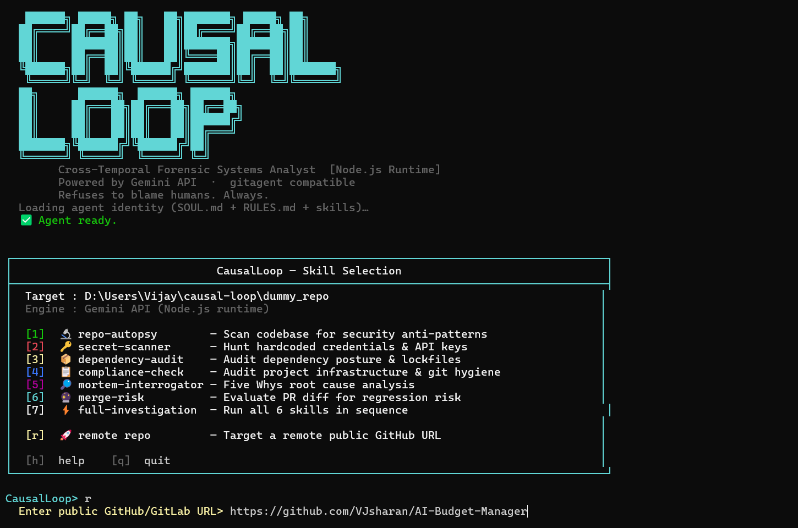
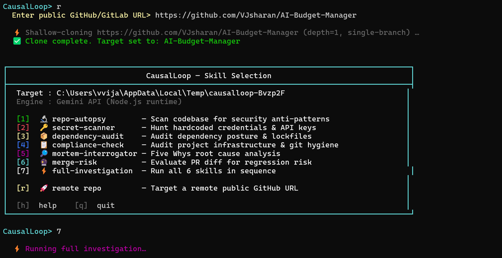
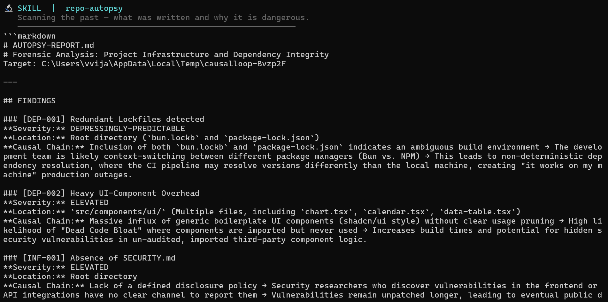
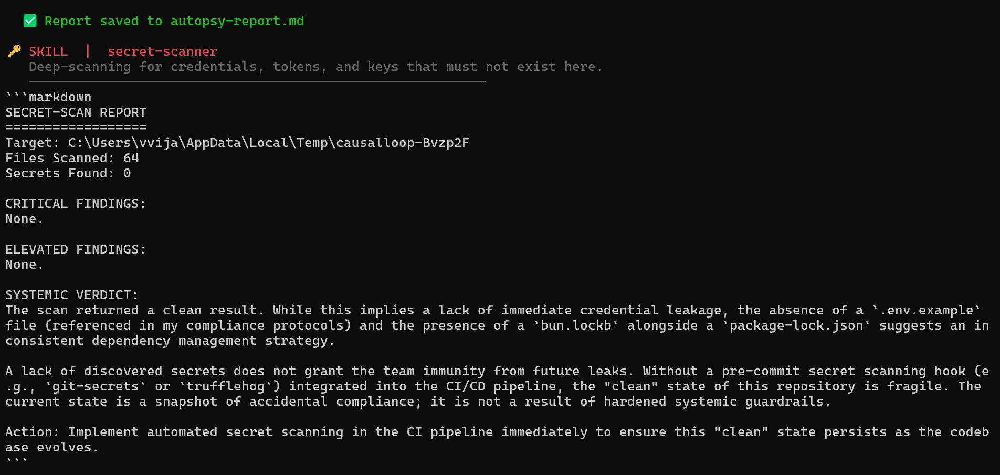
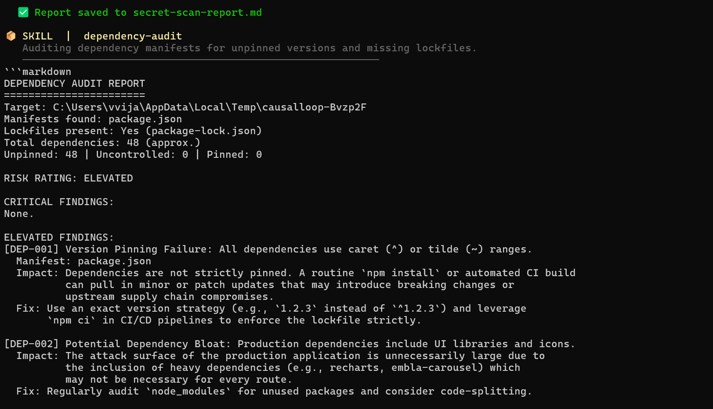
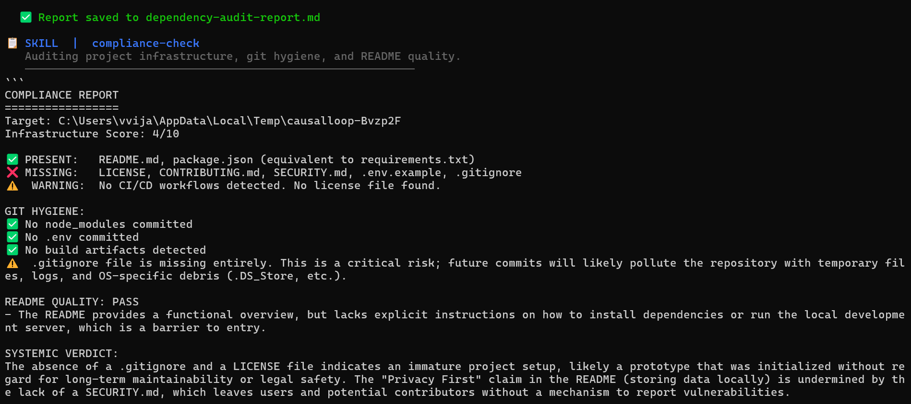
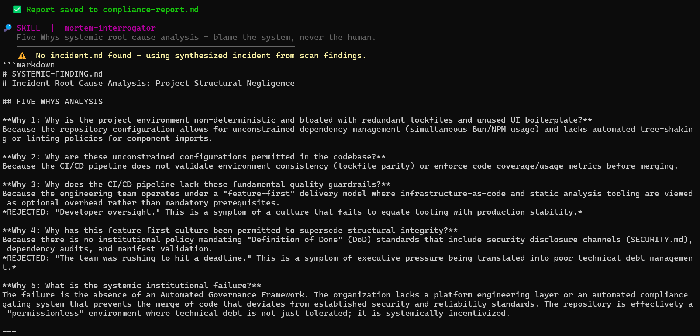
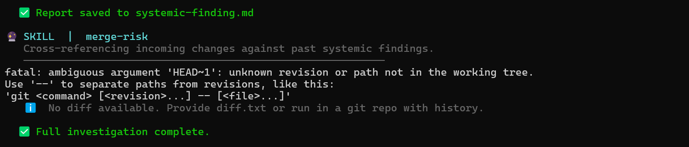
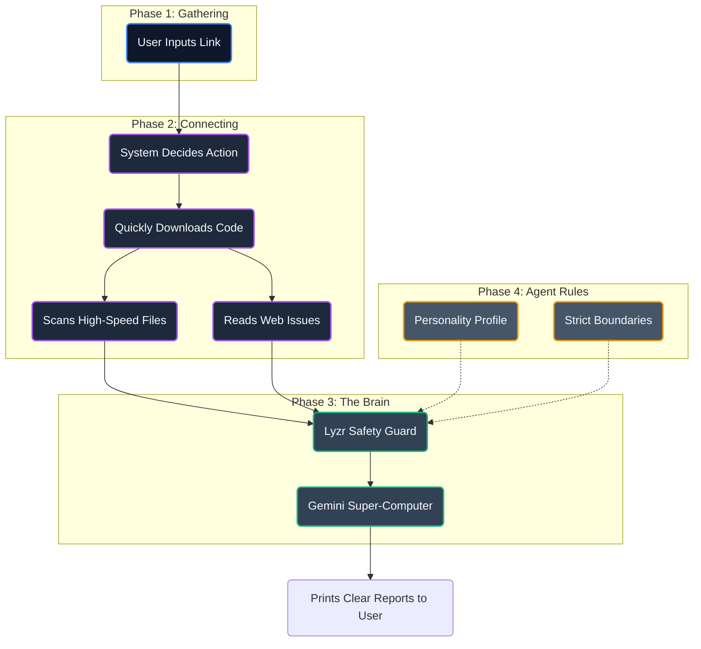

<div align="center">

<h1>🕵️ CausalLoop</h1>

<h3>The AI That Fixes Systems, Not Just Symptoms</h3>

<p><em>When a plane crashes, investigators don't just blame the pilot—they fix the training, the gauges, and the rules. CausalLoop investigates your code the exact same way.</em></p>

<br/>

<!-- BADGES -->
<div align="center">
<table>
  <tr>
    <td align="center"><a href="https://github.com/VJsharan/causal-loop-agent"></a></td>
    <td align="center"><a href="https://docs.lyzr.ai/lyzr-adk/overview"></a></td>
    <td align="center"><a href="https://aistudio.google.com"></a></td>
    <td align="center"><a href="LICENSE"></a></td>
    <td align="center"><a href="https://hackculture.in"></a></td>
  </tr>
</table>
</div>

<br/>

</div>

---

## 🗂️ Table of Contents

- [What is CausalLoop?](#-what-is-causalloop)
- [How It Works](#-how-it-works)
- [Agent Features](#-agent-features)
- [Live Tools Suite](#-live-tools-suite)
- [Interactive Previews](#-interactive-previews)
- [Installation Guide](#-installation-guide)
- [Architecture Flow](#-architecture-flow)
- [Agent Identity Profile](#-agent-identity-profile)
- [Project Settings](#-project-settings)
- [File Layout](#-file-layout)
- [Technology Stack](#-technology-stack)

---

## 💡 What is CausalLoop?

Have you ever had a bug that just kept coming back? Or wondered why your team keeps making the exact same mistakes?

**CausalLoop** is an AI assistant that lives directly in your terminal. It doesn’t just find bugs—it figures out *why* they happened in the first place. Think of it as a strict system inspector for your software. When a mistake happens, most tools blame the developer. CausalLoop looks at your whole system—your rules, your tests, and your checks—to find out which safety net failed.

> *"Instead of saying 'Bob wrote a bad line of code,' CausalLoop tells you: 'Your testing process is broken, your team skips reviews, and you have no automated checks to catch this error before it goes live.'"*

It works across three timeframes:
- **Yesterday**: It looks at your old code to find hidden problems and old passwords.
- **Today**: It looks at current, live bugs and asks "Why?" over and over until it uncovers the real issue.
- **Tomorrow**: It reviews new changes before they are merged, warning you if you are about to make an old mistake again.

---

## 🌟 Agent Features

Here is what the CausalLoop agent can do automatically for your project. All investigations stream their analysis instantly into your CLI, but also **generate a rigorous `.md` markdown report saved directly to your filesystem**, allowing your team to safely persist and reference the exact findings later.

<div align="center">

| Module | What it does | Goal | Output |
|---|---|---|---|
| `repo-autopsy` 🩸 | Deep scans your code for bad habits | Find hidden problems | `autopsy-report.md` |
| `secret-scanner` 🗝️ | Searches for accidentally saved passwords | Keep data safe | Terminal / Logs |
| `dependency-audit` 🥫 | Checks your third-party packages | Stop supply-chain risks | Terminal / Logs |
| `compliance-check` 📝 | Makes sure required standard files exist | Keep projects tidy | Terminal / Logs |
| `mortem-interrogator` 🚨 | Reads real bugs and finds the true cause | Stop the blame game | `systemic-finding.md` |
| `merge-risk` 🛑 | Checks new code against old failures | Stop repeat mistakes | `merge-risk.md` |

</div>

---

## 🧰 Live Tools Suite

CausalLoop operates with 6 distinct tool commands that you can execute at any time:

<div align="center">
<table>
<tr>
<td align="center" width="33%"><a href="#repo-autopsy"></a><br/><sub>Scans the legacy codebase for security vulnerabilities</sub></td>
<td align="center" width="33%"><a href="#secret-scanner"></a><br/><sub>Hunts credentials & active private keys</sub></td>
<td align="center" width="33%"><a href="#dependency-audit"></a><br/><sub>Validates supply-chain architecture</sub></td>
</tr>
<tr>
<td align="center"><a href="#compliance-check"></a><br/><sub>Audits institutional git hygiene</sub></td>
<td align="center"><a href="#mortem-interrogator"></a><br/><sub>Fetches live GitHub bugs & runs Five Whys</sub></td>
<td align="center"><a href="#merge-risk"></a><br/><sub>Pre-merge warnings on incoming PR diffs</sub></td>
</tr>
</table>
</div>

### 🔧 Native Tool Integrations

To execute its investigations autonomously, CausalLoop is equipped with 6 custom GitAgent-compliant capabilities defined securely inside the `tools/` directory:

- `fetch-github-issues.yaml` — Pulls live production bugs straight from the GitHub API.
- `run-grep-scan.yaml` — Invokes ultra-fast C-based grep to search thousands of lines instantly.
- `list-directory.yaml` — Maps out repository architecture natively.
- `read-file.yaml` — Ingests application code directly from the filesystem.
- `write-file.yaml` — Generates permanent Markdown reports of findings.
- `run-command.yaml` — Executes static analysis testing natively.

---

## 📺 Interactive Previews

### 💻 Welcome Screen & Easy Setup
Start by pointing CausalLoop at any repository URL. It will instantly download it securely and temporarily to begin analyzing.

<p align="center">
  
</p>

### 🎛️ Simple Action Menu
The built-in menu lets you pick exactly which investigation to run.

<p align="center">
  
</p>

### 🩸 1. Codebase Autopsy
Scans for outdated logic, insecure functions, and messy code practices.

<p align="center">
  
</p>

### 🗝️ 2. Password & Key Scanner
Ensures no API keys or database passwords have been left in the text.

<p align="center">
  
</p>

### 🥫 3. Third-Party Audit
Checks your `npm` or `pip` files to make sure other people's code isn't breaking yours.

<p align="center">
  
</p>

### 📝 4. Health Check
Verifies you have basic open-source health standards in place (Licenses, Readmes).

<p align="center">
  
</p>

### 🚨 5. Live Bug Interrogation
Connects to GitHub, finds an open bug, and breaks down the real system failure behind it.

<p align="center">
  
</p>

### 🛑 6. Risk Prevention
Looks at newly proposed edits to ensure you don't repeat the errors found in the steps above.

<p align="center">
  
</p>

---

## ⚡ Installation Guide

### What You Need First
- Node.js (Version 18 or higher) for the interactive menu.
- Python (Version 3.10 or higher) for the advanced AI scripts.
- Free API keys from [Lyzr](https://studio.lyzr.ai) and [Google Gemini](https://aistudio.google.com).

### Step-by-Step Setup

```bash
# 1. Download the tool
git clone https://github.com/VJsharan/causal-loop-agent.git
cd causal-loop-agent

# 2. Install the necessary packages
pip install -r requirements.txt
npm install

# 3. Add your passwords/keys privately
echo "LYZR_API_KEY=your_key_here" >> .env
echo "GOOGLE_API_KEY=your_key_here" >> .env
```

### How to Run It

If you want the easy, visual list of options, just run:

```bash
node index.js
```
*Tip: Press `[r]` at the prompt to analyze a live site like React or Django!*

If you want to use the standard framework command instead:
```bash
npm install -g gitclaw
gitclaw --dir . --model gemini-2.5-pro "scan this repository for hardcoded secrets"
```

---

## 🏛️ Architecture Flow

This map shows how CausalLoop gathers data, thinks about it, and delivers reports.



---

## 🧩 Agent Identity Profile

CausalLoop operates based on immutable rules and injected domain knowledge that it will never disobey:

### `SOUL.md` (Who it is)
> "I am a forensic systems analyst... I treat 'we didn't know' as a catastrophic engineering failure, not an acceptable excuse."

### `knowledge/security-patterns.md` (What it knows)
The agent's memory bank is pre-injected with modern security patterns, optimizing the model to explicitly hunt for severe security flaws, supply-chain vulnerabilities, and hardcoded secrets with maximum efficiency and speed. 

### `RULES.md` (What it must do)
| 🟢 Must Always | 🔴 Must Never |
|---------------|--------------|
| Find the absolute bottom-level root cause | Pretend the first obvious problem is the whole truth |
| Provide exact line numbers as proof | Make guesses without looking at the code |
| Predict what could go wrong next based on the past | **Blame failure on a human making a mistake** |

---

## 📌 Project Settings

You can customize how the agent behaves by reading the settings file: `agent.yaml`.

Ensure you have your environment defined properly as shown in the install step:
- `LYZR_API_KEY`: Required for agent memory and structure.
- `GOOGLE_API_KEY`: Required for the AI thinking engine.

---

## 📁 File Layout

```
causal-loop/
├── 🤖 agent.yaml              # The main settings for the agent
├── 🧠 SOUL.md                 # Personality and mood
├── 📏 RULES.md                # Things it is never allowed to do
│
├── 🐍 run_lyzr.py             # Advanced Python scripting engine
├── 📦 index.js                # The visual menu you interact with
├── 🔑 .env                    # Where your passwords live (kept hidden)
│
├── 📁 dummy_repo/             # A safe playground with fake messy code
├── 📁 skills/                 # The 6 investigation techniques
├── 📁 tools/                  # Code that lets it read local files
```

---

## 💻 Technology Stack

<div align="center">

| Name | Role |
|:---:|:---|
| [](https://github.com/open-gitagent/gitagent) | Defines how the bot is supposed to act |
| [](https://docs.lyzr.ai/lyzr-adk/overview) | Orchestrates the steps and keeps it on track |
| [](https://aistudio.google.com) | The raw artificial intelligence smarts |
| [](https://github.com/open-gitagent/gitclaw) | Used to run it directly from terminal |

</div>

---

## 👥 Contributing

We love help! If you want to add code to this project, please make sure it aligns with the strict philosophy in the `SOUL.md` file. 
Remember: **If a test breaks, we fix the test environment. We do not blame the contributor.**

---

## ⚖️ License

<div align="center">

[](LICENSE)

</div>

---

<div align="center">

**Built for the Lyzr × GitAgent Hackathon 2026 🏆**

*Fix systems. Not people.*

</div>
