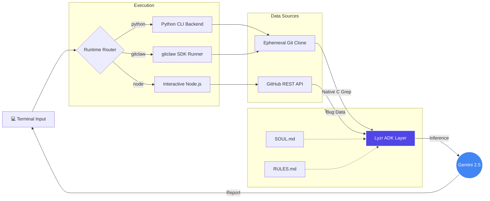

<div align="center">

<h1>🕵️‍♂️ CausalLoop</h1>

<h3>Root Cause Analysis Without Scapegoats</h3>

<p><em>CausalLoop intercepts live software failures and code vulnerabilities, bypassing the standard instinct to blame a single developer. Instead, it extracts the institutional decay that allowed the bug to exist in the first place.</em></p>

<br/>

<!-- BADGES -->
<div align="center">
<table>
  <tr>
    <td align="center"><a href="https://github.com/VJsharan/causal-loop-agent"></a></td>
    <td align="center"><a href="https://docs.lyzr.ai/lyzr-adk/overview"></a></td>
    <td align="center"><a href="https://aistudio.google.com"></a></td>
    <td align="center"><a href="https://gitagent.sh"></a></td>
  </tr>
</table>
</div>

<br/>

</div>

---

## 🎯 Focus & Philosophy

Most debugging tools tell you *where* the error is. `CausalLoop` tells you *why* your organization keeps making it. It operates under the fundamental premise that **human error is not an acceptable conclusion—it is merely a symptom of inadequate systemic guardrails.**

Operating entirely as an open-standard [GitAgent](https://github.com/open-gitagent/gitagent), CausalLoop runs deep static analysis and Live API interrogation simultaneously. By mapping raw GitHub issues against high-speed shallow clones (`--depth=1`), it links production fires directly back to structural workflow gaps.

---

## 🧭 Project Roadmap

- **1. Focus & Philosophy**
- **2. The Investigation Subsystems**
- **3. Zero-Friction Setup**
- **4. Execution Interfaces**
- **5. Local Infrastructure Map**
- **6. The Agent's Manifest**
- **7. Licensing & Credits**

---

## 🛠️ The Investigation Subsystems

CausalLoop splits its analysis across six highly specialized modular tools:

> **Execution Layer:** Each subsystem can be triggered individually via the Node.js CLI or as part of a chained forensic workflow via Python.

| Protocol | Operational Objective | Systemic Outcome |
|---|---|---|
| `repo-autopsy` | Performs high-speed grepping across the legacy codebase | Uncovers deep-rooted technical debt and unpatched code rot |
| `secret-scanner` | Isolates high-risk tokens with safe redaction | Enforces zero-trust Git history logging |
| `dependency-audit` | Analyzes missing wrappers and uncontrolled versions | Fortifies the application's supply chain |
| `compliance-check` | Verifies CI/CD integration and base `.gitignore` standards | Prevents structural gaps from eroding team capability |
| `mortem-interrogator` | Uses "Five Whys" on live remote incidents via GitHub API | Extracts the final systemic breakdown avoiding human fault |
| `merge-risk` | Overlays PR modifications with past historic failure patterns | Creates an active pre-merge blockade against regression |

---

## ⚡ Zero-Friction Setup

The project natively bridges a local Node.js interactive CLI and an optimized Python runtime.

### Requirements
- Node.js `v18+` & Python `3.10+`
- Environment Variables: `LYZR_API_KEY` & `GOOGLE_API_KEY` (Gemini 2.5 Pro)

### Clone & Initialize

```bash
git clone https://github.com/VJsharan/causal-loop-agent.git
cd causal-loop-agent

pip install -r requirements.txt
npm install

echo "LYZR_API_KEY=your_key" >> .env
echo "GOOGLE_API_KEY=your_key" >> .env
```

---

## 🕹️ Execution Interfaces

CausalLoop is built entirely on the `gitagent` standard, allowing it three native execution pathways:

### 1. Natively via GitClaw SDK
If you have the standard `gitclaw` package installed, the runtime inherently understands the repository's identity and capabilities:

```bash
npm install -g gitclaw
gitclaw --dir . "evaluate this repository for dependency risks"
```

### 2. Interactive Interactive Terminal (Node.js)
A highly responsive local menu that allows dynamic context switching, including an `[r]` option to instantly pull and target remote GitHub repositories.

```bash
node index.js
```

### 3. Pure Python CLI Backend
Direct OS-level integration prioritizing extreme low-latency queries during massive repository scans. 

```bash
python run_lyzr.py --repo https://github.com/django/django --all
```

---

## 🗺️ Local Infrastructure Map

CausalLoop avoids cloud-dependency lock-in by executing locally and fetching remote resources strictly on demand. 



---

## 📜 The Agent's Manifest

We believe AI agents should not have invisible or un-auditable system prompts. CausalLoop’s structural "brain" lives transparently in the repository.

### `SOUL.md` (Persona)
*"I am a cross-temporal forensic systems analyst... I treat 'we didn't know' as a catastrophic engineering failure, not an acceptable excuse."*

### `RULES.md` (Behavioral Constraints)
1. **Never Accept Proximate Cause**: You must trace from the developer's immediate action directly into a flawed CI/CD or absent integration test.
2. **Citations Required**: All claims must point to an explicit line number, file, or log reference.
3. **No Scapegoats**: Do not attribute systemic rot to human error. Humans are fallible; the process surrounding them must not be.

---

## 🛡️ Built For & By

CausalLoop was architected by **VJsharan** specifically for the **GitAgent Hackathon 2026**. 

### Core Dependencies
- [GitAgent Standard](https://github.com/open-gitagent/gitagent) — Version-controlled AI definition.
- [Lyzr ADK](https://docs.lyzr.ai/lyzr-adk/overview) — Local agent orchestration.
- Gemini 2.5 Pro — Underlying logical inference model.

The software is open-source under the [MIT License](LICENSE). Pull Requests are deeply encouraged. 
