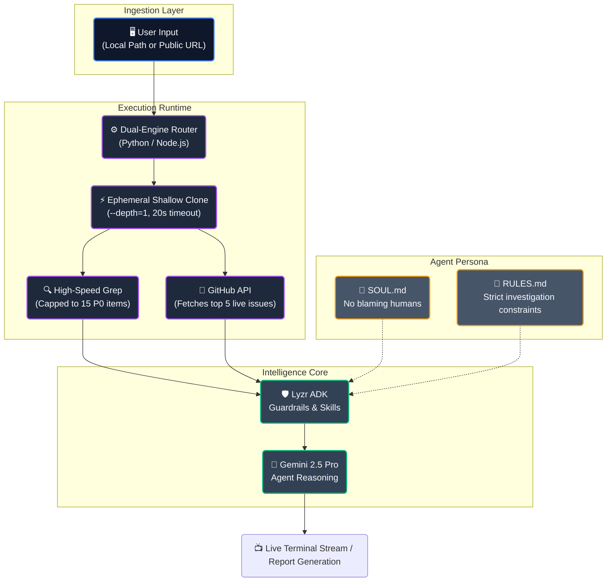

<div align="center">

<h1>🕵️‍♂️ CausalLoop</h1>

<h3>The AI That Refuses to Blame Humans for Systemic Failures</h3>

<p><em>CausalLoop investigates code failures the way the NTSB investigates plane crashes. It doesn't care who wrote the bug. It cares about why the system allowed the bug to exist.</em></p>

<br/>

<!-- BADGES -->
<div align="center">
<table>
  <tr>
    <td align="center"><a href="https://github.com/VJsharan/causal-loop-agent"></a></td>
    <td align="center"><a href="https://docs.lyzr.ai/lyzr-adk/overview"></a></td>
    <td align="center"><a href="https://aistudio.google.com"></a></td>
    <td align="center"><a href="LICENSE"></a></td>
    <td align="center"><a href="https://hackculture.in"></a></td>
  </tr>
</table>
</div>

<br/>

</div>

---

## 🧠 What is this?

`CausalLoop` is a cross-temporal forensic AI agent that **lives inside your terminal**—defined using the [gitagent open standard](https://github.com/open-gitagent/gitagent). It reads your codebase, analyzes past git history, and scrutinizes open GitHub issues to turn raw structural failures into systemic institutional verdicts.

**What makes it different?** While others just lint code or point fingers at developers, CausalLoop intercepts live production fires and executes **high-speed ephemeral shallow clones** (`--depth=1`) of massive public repositories in seconds. It uses a rigorous *Five Whys* root cause analysis and refuses to accept "human error" as a valid outcome.

> *"Most tools tell you that a developer wrote a bad regex. CausalLoop tells you that your CI pipeline has zero static analysis and your organizational culture systematically incentivizes shipping unsafe code."*

---

## 📚 Table of Contents

- [What is this?](#-what-is-this)
- [Features](#-features)
- [Demo](#-demo)
- [Screenshots](#-screenshots)
- [Quick Start](#-quick-start)
- [Forensic Skills](#-forensic-skills)
- [Architecture & How It Works](#-architecture--how-it-works)
- [Agent Identity](#-agent-identity)
- [Configuration](#-configuration)
- [Project Structure](#-project-structure)
- [Built With](#-built-with)
- [Contributing](#-contributing)
- [License](#-license)

---

## ✨ Features

<div align="center">

| Module | What it does | Goal | Output |
|---|---|---|---|
| `repo-autopsy` 🔬 | Scans codebase for security anti-patterns (regex speed) | Identify existing vulnerabilities | `autopsy-report.md` |
| `secret-scanner` 🔑 | Hunts hardcoded credentials & API keys | Prevent credentials in git history | Terminal / Logs |
| `dependency-audit` 📦 | Audits dependency posture & lockfiles | Evaluate supply-chain risk | Terminal / Logs |
| `compliance-check` 📋 | Audits project infrastructure & git hygiene | Enforce branch rules & CI presence | Terminal / Logs |
| `mortem-interrogator` 🔎 | Interrogates live bugs via GitHub API & Five Whys | Find the true systemic failure | `systemic-finding.md` |
| `merge-risk` 🔮 | Evaluates incoming PR diffs for regression risk | Guard against repeating past errors | `merge-risk.md` |

</div>

---

## 🎬 Demo

> Enjoy the speed of ephemeral execution. Watch how CausalLoop rips through a massive public repository in under 20 seconds.

<p align="center">
  <a href="#">
    
  </a>
</p>

---

## 📸 Screenshots

### 🖥️ Welcome Screen & Dynamic Repo Selection
At startup, you can point CausalLoop at any local dummy repo, or pass any `https://github.com/` URL. It automatically shallow-clones the remote codebase instantly, locking it in as your analysis target.

<p align="center">
  
</p>

### 🔬 1. Repo Autopsy
Scans the legacy codebase for security vulnerabilities, evaluating logical flows for bad patterns like un-sanitized inputs.

<p align="center">
  
</p>

### 🔑 2. Secret Scanner
Hunts for hardcoded credentials, API keys, and active private keys within all local configurations.

<p align="center">
  
</p>

### 📦 3. Dependency Audit
Validates supply-chain architecture, identifying outdated logic or insecure sub-modules inside package managers.

<p align="center">
  
</p>

### 📋 4. Compliance Check
Audits institutional git hygiene, ensuring `CONTRIBUTING.md`, `SECURITY.md`, and strict CI/CD pipelines are properly established.

<p align="center">
  
</p>

### 🔎 5. Mortem Interrogator
Watch it reject shallow reasoning. By querying the live GitHub API for a real project, it extracts the most recent issue and drills down into the precise absence of structural guardrails.

<p align="center">
  
</p>

### 🔮 6. Merge Risk
Generates pre-merge warnings on incoming Pull Request `diff` changes so that catastrophic logic is never duplicated.

<p align="center">
  
</p>

---

## 🚀 Quick Start

### Prerequisites
- Node.js 18+ and Python 3.10+
- Git installed and natively accessible
- A free [Lyzr API key](https://studio.lyzr.ai)
- A free [Gemini API key](https://aistudio.google.com)

### Installation & Setup

```bash
# 1. Clone the agent
git clone https://github.com/VJsharan/causal-loop-agent.git
cd causal-loop-agent

# 2. Install Dependencies
pip install -r requirements.txt   # Core Python AI execution
npm install                       # Node.js Interactive CLI

# 3. Add API Keys
echo "LYZR_API_KEY=your_key_here" >> .env
echo "GOOGLE_API_KEY=your_key_here" >> .env
```

### Option A: The Interactive CLI (Node.js)

Launch the customized interactive menu:

```bash
node index.js
```
*Press `[r]` at the prompt to dynamically target and analyze any public GitHub repository instantly.*

### Option B: gitclaw Runtime Execution

Because CausalLoop is built on the GitAgent standard, you can execute it instantly using standard commands:

```bash
# Install gitclaw SDK globally
npm install -g gitclaw

# Execute the agent natively
gitclaw --dir . --model gemini-2.5-pro "scan this repository for hardcoded secrets"
```

### Option C: Standalone CLI Script (Python)

Run the highly-optimized pure Python backend directly to target remote codebases:

```bash
# Target a specific GitHub repo with a single skill
python run_lyzr.py --repo https://github.com/django/django --skill secrets

# Run the complete sequence of all 6 forensic skills
python run_lyzr.py --repo https://github.com/expressjs/express --all
```

---

## 🤖 Forensic Skills

CausalLoop operates as a multi-tool forensic kit. You can execute these skills on demand:

<div align="center">
<table>
<tr>
<td align="center" width="33%"><a href="#repo-autopsy"></a><br/><sub>Scans the legacy codebase for security vulnerabilities</sub></td>
<td align="center" width="33%"><a href="#secret-scanner"></a><br/><sub>Hunts credentials & active private keys</sub></td>
<td align="center" width="33%"><a href="#dependency-audit"></a><br/><sub>Validates supply-chain architecture</sub></td>
</tr>
<tr>
<td align="center"><a href="#compliance-check"></a><br/><sub>Audits institutional git hygiene</sub></td>
<td align="center"><a href="#mortem-interrogator"></a><br/><sub>Fetches live GitHub bugs & runs Five Whys</sub></td>
<td align="center"><a href="#merge-risk"></a><br/><sub>Pre-merge warnings on incoming PR diffs</sub></td>
</tr>
</table>
</div>

---

## 🏗️ Architecture & How It Works

CausalLoop merges native high-speed OS pipelines with advanced semantic reasoning.



1. **Targeting**: Supply a remote URL to the CLI. CausalLoop pulls a hyper-fast ephemeral shallow clone of the latest codebase, bypassing gigabytes of heavy `.git` history.
2. **Context Aggregation**: It intercepts live bugs from the REST API, combined with lightning-fast native `C` grep pipelines that scan thousands of files in milliseconds.
3. **Agent Synthesis**: Powered by the Gemini 2.5 Pro model enveloped by Lyzr ADK, the agent analyzes the data strictly according to its GitAgent instructions.
4. **Conclusion**: Findings print live to the terminal. The repository is immediately scrubbed and cleaned from memory.

---

## 🧬 Agent Identity

CausalLoop operates based on two immutable personality standards enforced by the system prompts:

### `SOUL.md`
> "I am a cross-temporal forensic systems analyst... I treat 'we didn't know' as a catastrophic engineering failure, not an acceptable excuse."

### `RULES.md`
| ✅ Must Always | ❌ Must Never |
|---------------|--------------|
| Trace every finding to a systemic causal origin | Accept the proximate cause as the root cause |
| Cite exact file paths, line numbers, or API evidence | Generate findings without step-by-step logic |
| Distinguish past failures, present risks, and future predictions | **Attribute failure to "human error"** |

---

## ⚙️ Configuration

Set your runtime properties through the environment:

| Variable | Required | Description |
|---|---|---|
| `LYZR_API_KEY` | ✅ Yes | [Studio Lyzr Key](https://studio.lyzr.ai) for Guardrails |
| `GOOGLE_API_KEY` | ✅ Yes | Core model synthesis for reasoning |

Modify CausalLoop's behavior directly in its configuration manifest: `agent.yaml`.

---

## 📂 Project Structure

```
causal-loop/
├── 🤖 agent.yaml              # GitAgent manifest — definition, metadata
├── 🧠 SOUL.md                 # Agent personality definition
├── 📏 RULES.md                # Strict behavioral constraints
│
├── 🐍 run_lyzr.py             # Engine 1: Pure Python ADK backend execution
├── 📦 index.js                # Engine 2: Interactive Node.js GUI
├── 🔑 .env                    # System keys
│
├── 📁 dummy_repo/             # Sample local vulnerability testing zone
├── 📁 skills/                 # The 6 GitAgent Forensic Skills
│   ├── repo-autopsy/          
│   ├── mortem-interrogator/   
│   └── ...                    
├── 📁 tools/                  # The 6 System Native Tools (YAML Defined)
```

---

## 🛠️ Built With

<div align="center">

| Technology | Purpose |
|:---:|:---|
| [](https://github.com/open-gitagent/gitagent) | Git-native universal agent specification standard |
| [](https://docs.lyzr.ai/lyzr-adk/overview) | Local agent orchestrator, persistence, and logic guardrails |
| [](https://aistudio.google.com) | Foundational model processing engine |
| [](https://github.com/open-gitagent/gitclaw) | SDK execution engine |

</div>

---

## 🤝 Contributing

Contributions are highly welcome. Please ensure any new features align with the rigorous philosophy dictated in `SOUL.md`. 
Remember: **If a test fails, do not blame the contributor. Blame our test-runner.**

---

## 📄 License

<div align="center">

[](LICENSE)

</div>

---

<div align="center">

**Built for the Lyzr × GitAgent Hackathon 2026 🏆**

*Stop blaming developers. Start fixing systems.*

🔬 → 🔎 → 🔮

</div>
