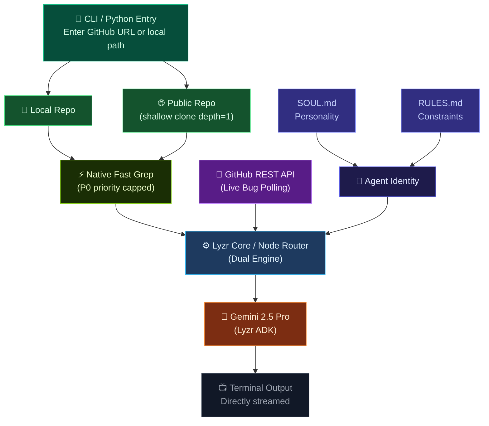

<div align="center">

<h1>🕵️‍♂️ CausalLoop</h1>

<p><strong>The AI That Refuses to Blame Humans.</strong></p>

<p><em>CausalLoop investigates code failures the way the NTSB investigates plane crashes. It doesn't care who wrote the bug. It cares about why the system allowed the bug to exist.</em></p>

<br/>

<!-- BADGES -->
<div align="center">
<table>
  <tr>
    <td align="center"><a href="https://github.com/VJsharan/causal-loop-agent"></a></td>
    <td align="center"><a href="https://docs.lyzr.ai/lyzr-adk/overview"></a></td>
    <td align="center"><a href="https://aistudio.google.com"></a></td>
    <td align="center"><a href="LICENSE"></a></td>
    <td align="center"><a href="https://gitagent.sh"></a></td>
  </tr>
</table>
</div>

<br/>

</div>

---

## 🧠 What is this?

`CausalLoop` is a dual-runtime (Python & Node.js) forensic AI agent that **lives inside your terminal** - defined using the [gitagent open standard](https://github.com/open-gitagent/gitagent). It reads your codebase and open GitHub issues, turning raw structural failures into systemic institutional verdicts.

**What makes it different?** While others just lint code or point fingers at developers, CausalLoop executes **high-speed ephemeral shallow clones** (`--depth=1`) of massive public repositories in seconds, intercepts live production fires from the GitHub API, and conducts rigorous *Five Whys* root cause analysis. It strictly refuses to accept "human error" as a verdict.

> *"Human error is not a root cause. It is a consequence of insufficient guardrails."*
> — CausalLoop

---

## 📚 Table of Contents

- [What is this?](#-what-is-this)
- [Features](#-features)
- [Quick Start](#-quick-start)
- [Forensic Skills](#-forensic-skills)
- [How It Works](#-how-it-works)
- [Configuration](#-configuration)
- [Built With](#-built-with)
- [Contributing](#-contributing)
- [License](#-license)

---

## ✨ Features

<div align="center">

| Skill | What it does | Goal |
|---|---|---|
| `repo-autopsy` 🔬 | Scans codebase for security anti-patterns (regex speed) | Identify existing vulnerabilities |
| `secret-scanner` 🔑 | Hunts hardcoded credentials & API keys | Prevent credentials in git history |
| `dependency-audit` 📦 | Audits dependency posture & lockfiles | Evaluate supply-chain risk |
| `compliance-check` 📋 | Audits project infrastructure & git hygiene | Enforce branch rules & CI presence |
| `mortem-interrogator` 🔎 | Interrogates live bugs via GitHub API & Five Whys | Find the true systemic failure |
| `merge-risk` 🔮 | Evaluates incoming PR diffs for regression risk | Guard against repeating past errors |

</div>

---

## 🚀 Quick Start

### Prerequisites
- Python 3.10+ / Node.js 18+
- Git installed and in PATH
- A free [Lyzr API key](https://studio.lyzr.ai)
- A free [Gemini API key](https://aistudio.google.com)

### Installation

```bash
# 1. Clone the agent
git clone https://github.com/VJsharan/causal-loop-agent.git
cd causal-loop-agent

# 2. Install Python dependencies (for Lyzr backend)
pip install -r requirements.txt

# 3. Add your API keys
echo "LYZR_API_KEY=your_key_here" >> .env
echo "GOOGLE_API_KEY=your_key_here" >> .env

# 4. Run the interactive CLI (Node.js)
node index.js
```

At startup, you'll enter the fully interactive CLI. Press `[r]` to analyze any public GitHub URL on the fly, or just select a skill to scan the local `dummy_repo`.

### Running the Pure Python Lyzr Backend

```bash
# Run one specific skill on a public repo
python run_lyzr.py --repo https://github.com/django/django --skill secrets

# Run all 6 skills in sequence
python run_lyzr.py --repo https://github.com/django/django --all
```

---

## 🤖 Forensic Skills

<div align="center">
<table>
<tr>
<td align="center" width="33%"><a href="#-repo-autopsy"></a><br/><sub>Scans the past codebase for fatal patterns</sub></td>
<td align="center" width="33%"><a href="#-secret-scanner"></a><br/><sub>Hunts credentials & active private keys</sub></td>
<td align="center" width="33%"><a href="#-dependency-audit"></a><br/><sub>Validates supply-chain architecture</sub></td>
</tr>
<tr>
<td align="center"><a href="#-compliance-check"></a><br/><sub>Audits institutional git hygiene</sub></td>
<td align="center"><a href="#-mortem-interrogator"></a><br/><sub>Fetches GitHub issues & runs Five Whys</sub></td>
<td align="center"><a href="#-merge-risk"></a><br/><sub>Pre-merge risk warnings on incoming diffs</sub></td>
</tr>
</table>
</div>

---

## 🏗️ How It Works



1. **At startup**, choose to analyze the local codebase or input a public GitHub repository. The software executes a sub-3-second *ephemeral shallow clone*.
2. **Context Assembly**: It intercepts live bugs from the GitHub API and uses `git grep -inE` inside a priority-bucket system (P0: keys, P1: vectors, P2: debt) to scan massive codebases safely.
3. **Agent execution**: Powered by Gemini 2.5 Pro and Lyzr ADK, it runs a rigorous *Five Whys* interrogation and streams terminal output directly to you.
4. **Clean up**: All temporary clone trails are strictly swept up after execution.

---

## 🔧 Configuration

### Environment Variables

<div align="center">

| Variable | Required | Description |
|---|---|---|
| `LYZR_API_KEY` | ✅ Yes | Your Lyzr ADK key - [get one free](https://studio.lyzr.ai) |
| `GOOGLE_API_KEY` | ✅ Yes | Your Gemini API key for logic synthesis |

</div>

---

## 🧩 Built With

<div align="center">

| Technology | Purpose |
|:---:|:---|
| [](https://docs.lyzr.ai/lyzr-adk/overview) | Agent persistence, routing, and guardrails |
| [](https://aistudio.google.com) | LLM inference backend |
| [](https://github.com/open-gitagent/gitagent) | Version-controlled AI personality definition |
| [](#) | Cross-language environment compatibility |

</div>

---

## 🤝 Contributing

Contributions, issues, and feature requests are highly welcome! Review the `RULES.md` file before submitting PRs—human error is still strictly prohibited.

---

## 📄 License

<div align="center">

[](LICENSE)

</div>
