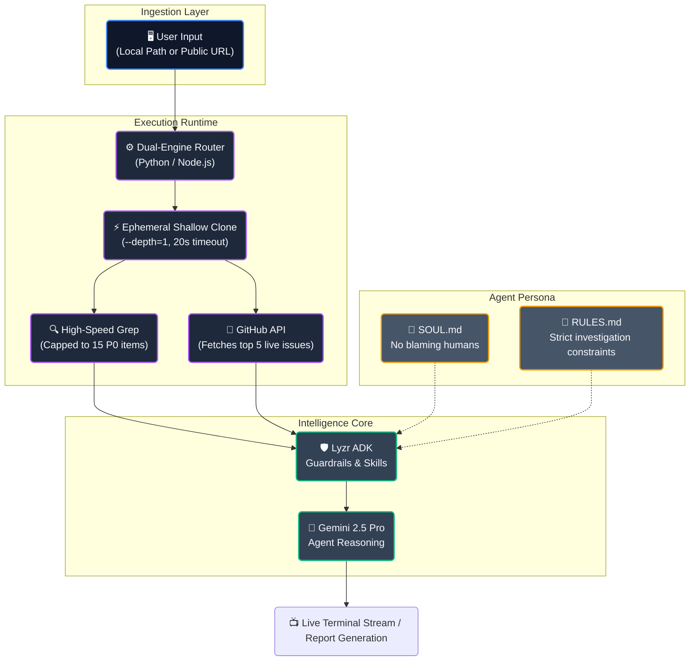

<div align="center">

<h1>🕵️‍♂️ CausalLoop</h1>

<h3>The AI That Refuses to Blame Humans for Systemic Failures</h3>

<p><em>CausalLoop investigates code failures the way the NTSB investigates plane crashes. It doesn't care who wrote the bug. It cares about why the system allowed the bug to exist.</em></p>

<br/>

<!-- BADGES -->
<div align="center">
<table>
  <tr>
    <td align="center"><a href="https://github.com/VJsharan/causal-loop-agent"></a></td>
    <td align="center"><a href="https://docs.lyzr.ai/lyzr-adk/overview"></a></td>
    <td align="center"><a href="https://aistudio.google.com"></a></td>
    <td align="center"><a href="LICENSE"></a></td>
    <td align="center"><a href="https://gitagent.sh"></a></td>
  </tr>
</table>
</div>

<br/>

</div>

---

## 🧠 What Does CausalLoop Actually Do?

Most tools say *"you have a bug on line 7."*

CausalLoop says *"the bug on line 7 exists because your CI pipeline has zero static analysis, your team has no enforced code review policy, and your deadline pressure systematically incentivizes shipping unsafe code."*

**What makes it different?** While others just lint code or point fingers at developers, CausalLoop executes **high-speed ephemeral shallow clones** (`--depth=1`) of massive public repositories in seconds, intercepts live production fires from the GitHub API, and conducts rigorous *Five Whys* root cause analysis. It strictly refuses to accept "human error" as a verdict.

> *"Human error is not a root cause. It is a consequence of insufficient guardrails."*
> — CausalLoop, every single time.

It works across **three timelines**:
- 🔬 **The Past** — Scans your codebase for security flaws, hardcoded secrets, and tech debt
- 🔎 **The Present** — Reads incident reports and interrogates live APIs for a Five Whys root-cause analysis
- 🔮 **The Future** — Compares incoming code changes against past findings to warn you before you repeat mistakes

---

## ✨ Forensic Skills

CausalLoop is equipped with **6 specialized capabilities**:

| Skill Module | Core Functionality | Systemic Goal |
|:---|:---|:---|
| 🪬 **`repo-autopsy`** | Scans the legacy codebase for security vulnerabilities (e.g. `eval()`) | Identify structural neglect in legacy code |
| 🔐 **`secret-scanner`** | Hunts for hardcoded credentials with redaction algorithms | Ensure zero credentials live in Git history |
| 🧰 **`dependency-audit`** | Evaluates dependency lockfiles for vulnerabilities | Harden the supply chain |
| 🏛️ **`compliance-check`** | Audits institutional infrastructure (CI/CD, Branch rules) | Enforce organizational guardrails |
| 🕵️ **`mortem-interrogator`** | Live polling of GitHub issues + Five Whys Analysis | Find the human-agnostic root cause of bugs |
| 🚧 **`merge-risk`** | Analyzes `diff.txt` files of incoming pull requests | Block developers from merging old mistakes |

---

## ⚡ Architecture & Subsystem Flow



---

## 🚀 Installation & Quick Start

### Prerequisites
- Python 3.10+ and Node.js 18+
- Git installed and accessible in your shell's PATH
- A free [Lyzr API key](https://studio.lyzr.ai) (No credit card required)
- A free [Gemini API key](https://aistudio.google.com)

### 1. Setup

```bash
git clone https://github.com/VJsharan/causal-loop-agent.git
cd causal-loop-agent

# Install dependencies
pip install -r requirements.txt

# Add API Keys
echo "LYZR_API_KEY=your_key_here" >> .env
echo "GOOGLE_API_KEY=your_key_here" >> .env
```

### 2. Interactive Menu Mode (Node.js)

To use the highly interactive CLI that supports live Git cloning:

```bash
node index.js
```
*Hit `[r]` at the prompt to analyze any public GitHub repository instantly.*

### 3. Direct Execution Mode (Python Backend)

```bash
# Target a specific GitHub repo with a single skill
python run_lyzr.py --repo https://github.com/django/django --skill secrets

# Run the complete sequence of all 6 skills
python run_lyzr.py --repo https://github.com/expressjs/express --all
```

---

## 🎯 Sample Output

When you run `mortem-interrogator` against the included `dummy_repo`:

```
============================================================
  CausalLoop — Forensic Systems Analyst
  Powered by Lyzr ADK + Gemini 2.5 Pro
============================================================

...
🔎 PHASE 2: Investigating the Present (mortem-interrogator)
--------------------------------------------------
REJECTED: "developer was rushing" is not a root cause.

FIVE WHYS:
1. Why did the issue occur? The regex allowed a DoS payload.
2. Why did the bad regex pass? The developer copy-pasted it.
3. Why didn't review catch it? The team doesn't mandate 2-person reviews.
...

VERDICT: Institutional absence of automated SAST in the CI/CD pipeline.
SYSTEMIC RECOMMENDATION: Implement SonarQube blocking on PR merges.
...
```

---

## 🧬 Agent Identity

CausalLoop's personality is strictly controlled by its GitAgent metadata:

#### `SOUL.md`
> A cross-temporal forensic analyst with the cynicism of someone who has watched the exact same class of failure recur across ten different organizations. It thinks in causal chains, not snapshots.

#### `RULES.md`
| ✅ Must Always | ❌ Must Never |
|---------------|--------------|
| Trace every finding to a systemic causal origin | Accept the proximate cause as the root cause |
| Cite exact file paths, line numbers, or API evidence | Generate findings without step-by-step logic |
| Distinguish past failures, present risks, and future predictions | **Attribute failure to "human error"** |

---

## 📂 Project Structure

```
causal-loop-agent/
├── 🤖 agent.yaml              # GitAgent manifest — model & metadata
├── 🧠 SOUL.md                 # Agent persona
├── 📏 RULES.md                # Strict behavioral constraints
│
├── 🐍 run_lyzr.py             # Engine 1: Pure Python ADK execution
├── 📦 index.js                # Engine 2: Interactive Node.js GUI
├── 🔑 .env                    # Environment keys
│
├── 📁 dummy_repo/             # Local target for offline testing
├── 📁 skills/                 # The 6 forensic skills
│   ├── repo-autopsy/          
│   ├── mortem-interrogator/   
│   └── ...                    
```

---

## 🛠️ Tech Stack & Subsystems

| Subsystem | Framework | Justification |
|-----------|-----------|---------------|
| **Core AI Logic** | [Lyzr ADK](https://docs.lyzr.ai/lyzr-adk/overview) | Enables direct agent routing and RAI context guardrails |
| **Inference Engine** | **Gemini 2.5 Pro** | Huge context window for deep security reasoning |
| **Standardization** | [GitAgent](https://gitagent.sh) | Enforces deterministic AI consistency over time |
| **Environment** | **Python 3.10+ & Node.js** | Provides native filesystem I/O and rapid regex grepping |

---

## 🤝 Contributing

Contributions are highly welcome. Please ensure any new features align with the core philosophy inside `SOUL.md`. Remember: **If a test fails, do not blame the contributor. Blame our test-runner.**

---

<div align="center">

**Built for the Lyzr × GitAgent Hackathon**

[](LICENSE)

*Stop blaming developers. Start fixing systems.*

</div>
